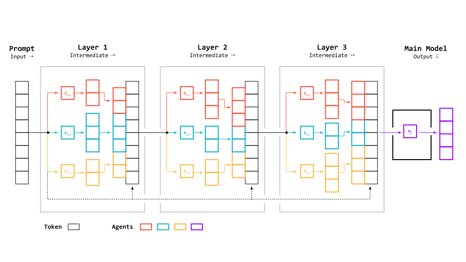

# Mixture-of-Agents using Groq

This Streamlit application showcases the Mixture of Agents (MOA) architecture proposed by Together AI, powered by Groq LLMs. It allows users to interact with a configurable multi-agent system for enhanced AI-driven conversations.

<!--  -->
<!-- *Source: Adaptation of [Together AI Blog - Mixture of Agents](https://www.together.ai/blog/together-moa)* -->

## Features

- Interactive chat interface powered by MOA
- Configurable main model and layer agents
- Real-time streaming of responses
- Visualization of intermediate layer outputs
- Customizable agent parameters through the UI

## Installation

1. Clone the repository:
   ```
   git clone https://https://github.com/kram254/Mixture-of-Agents-running-on-Groq.git
   cd Mixture-of-Agents-running-on-Groq
   ```

2. Install the required dependencies:
   ```
   pip install -r requirements.txt
   ```

3. Set up your environment variables:
   Create a `.env` file in the root directory and add your Groq API key:
   ```
   GROQ_API_KEY=your_api_key_here
   ```

## Usage

1. Run the Streamlit app:
   ```
   streamlit run app.py
   ```

2. Open your web browser and navigate to the URL provided by Streamlit (usually `http://localhost:8501`).

3. Use the sidebar to configure the MOA settings:
   - Select the main model
   - Set the number of cycles
   - Customize the layer agent configuration

4. Start chatting with the MOA system using the input box at the bottom of the page.

## Project Structure

- `app.py`: Main Streamlit application file
- `moa/`: Package containing the MOA implementation
  - `__init__.py`: Package initializer
  - `moa.py`: Core MOA agent implementation
  - `prompts.py`: System prompts for the agents
- `main.py`: CLI version of the MOA chat interface
- `requirements.txt`: List of Python dependencies
- `static/`: Directory for static assets (images, etc.)

## Configuration

The MOA system can be configured through the Streamlit UI or by modifying the default configuration in `app.py`. The main configurable parameters are:

- Main model: The primary language model used for generating final responses
- Number of cycles: How many times the layer agents are invoked before the main agent
- Layer agent configuration: A JSON object defining the system prompts, model names, and other parameters for each layer agent

## Contributing

Contributions to this project are welcome! Please follow these steps to contribute:

1. Fork the repository
2. Create a new branch for your feature or bug fix
3. Make your changes and commit them with descriptive commit messages
4. Push your changes to your fork
5. Submit a pull request to the main repository


## Acknowledgements

- [Groq](https://groq.com/) for providing the underlying language models
- [Together AI](https://www.together.ai/) for proposing the Mixture of Agents architecture and providing the conceptual image
- [Streamlit](https://streamlit.io/) for the web application framework
